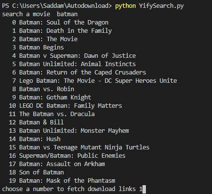
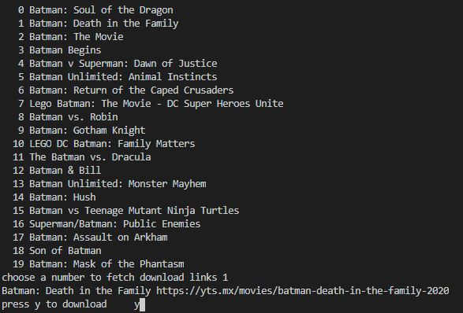
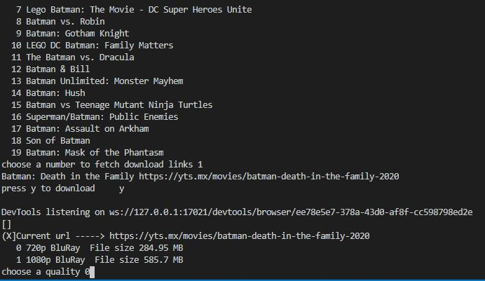
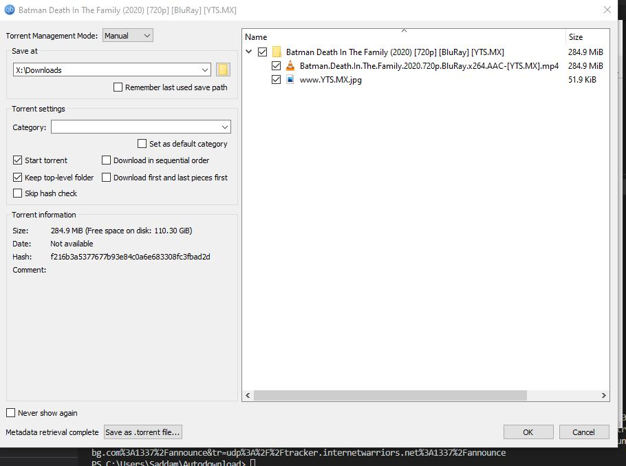

# YifyDownloader
Download Yify torrent from terminal 


<!-- PROJECT SHIELDS -->


<!-- PROJECT LOGO -->
<br />
<p align="center">

  <h3 align="center">YifyDownloader</h3>

</p>


<!-- TABLE OF CONTENTS -->
<details open="open">
  <summary><h2 style="display: inline-block">Table of Contents</h2></summary>
  <ol>
    <li>
      <a href="#about-the-project">About The Project</a>
      <ul>
        <li><a href="#built-with">Built With</a></li>
      </ul>
    </li>
    <li>
      <a href="#getting-started">Getting Started</a>
      <ul>
        <li><a href="#prerequisites">Prerequisites</a></li>
        <li><a href="#installation">Installation</a></li>
      </ul>
    </li>
    <li><a href="#usage">Usage</a></li>
    <li><a href="#roadmap">Roadmap</a></li>
    <li><a href="#contributing">Contributing</a></li>
    <li><a href="#license">License</a></li>
    <li><a href="#contact">Contact</a></li>
    <li><a href="#acknowledgements">Acknowledgements</a></li>
  </ol>
</details>


<!-- ABOUT THE PROJECT -->
## About The Project


An automated script to search and download movies from the giant yify.


### Built With

* Python
* BeautifulSoup
* <del>selenium</del>


<!-- GETTING STARTED -->
## Getting Started

you need to have python installed

### Prerequisites

things you need to installand how to install them.
* <del>Chrome webdriver</del>
  
* any torrent client
* Beatifulsoup
  ```sh
  pip install beautifulsoup4
  ```
* art
  ```sh
  pip install art
  ```  
### Installation

1. Clone the repo or download directly the files needed
   ```sh
   git clone https://github.com/ktifler/YifyDownloader
   ```
2. <del>chromedriver.exe need to be in the same directory as the script.</del>
  


<!-- USAGE EXAMPLES -->
## Usage

1. run the script and type a keyword ( movie name) example : batman
  
2.choose a movie number from the list and type y if you want to download

4.choose a quality

5.download will start with default torrent client



<!-- ROADMAP -->
## Roadmap


<!-- CONTRIBUTING -->
## Contributing

Contributions are what make the open source community such an amazing place to be learn, inspire, and create. Any contributions you make are **greatly appreciated**.

1. Fork the Project
2. Create your Feature Branch (`git checkout -b feature/AmazingFeature`)
3. Commit your Changes (`git commit -m 'Add some AmazingFeature'`)
4. Push to the Branch (`git push origin feature/AmazingFeature`)
5. Open a Pull Request


<!-- LICENSE -->
## License

MIT License

Copyright (c) 2021 ktifler

Permission is hereby granted, free of charge, to any person obtaining a copy
of this software and associated documentation files (the "Software"), to deal
in the Software without restriction, including without limitation the rights
to use, copy, modify, merge, publish, distribute, sublicense, and/or sell
copies of the Software, and to permit persons to whom the Software is
furnished to do so, subject to the following conditions:

The above copyright notice and this permission notice shall be included in all
copies or substantial portions of the Software.

THE SOFTWARE IS PROVIDED "AS IS", WITHOUT WARRANTY OF ANY KIND, EXPRESS OR
IMPLIED, INCLUDING BUT NOT LIMITED TO THE WARRANTIES OF MERCHANTABILITY,
FITNESS FOR A PARTICULAR PURPOSE AND NONINFRINGEMENT. IN NO EVENT SHALL THE
AUTHORS OR COPYRIGHT HOLDERS BE LIABLE FOR ANY CLAIM, DAMAGES OR OTHER
LIABILITY, WHETHER IN AN ACTION OF CONTRACT, TORT OR OTHERWISE, ARISING FROM,
OUT OF OR IN CONNECTION WITH THE SOFTWARE OR THE USE OR OTHER DEALINGS IN THE
SOFTWARE.


<!-- CONTACT -->
## Contact
if you need any help in web scraping project please check our Fiverr 

Martin_Dubois_ - [Fiverr](https://www.fiverr.com/martin_dubois_) 

Project Link: [https://github.com/ktifler/YifyDownloader](https://github.com/ktifler/YifyDownloader)


<!-- ACKNOWLEDGEMENTS -->
## Acknowledgements


